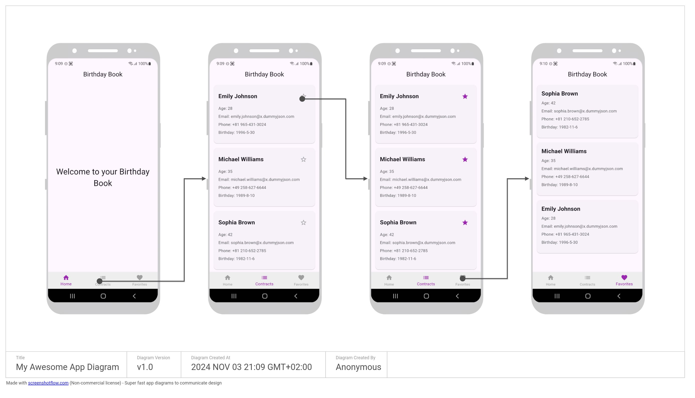

# lab2  : Flutter App for CSE431

Lab 2 for CSE431 - Mobile Programming's Flutter App

## Functionalities

1.	 Home Screen :Welcomes users and provides navigation. It includes a navigation bar to navigate to
•	User List Screen 
•	Birthday List Screen 
2.	User List Screen : Displays a list of Users. 
• Users are fetched from an API and display essential details (e.g., name,email, profile picture). 
•	Users can tap a user to view their profile. 
•	Users can add users to their favourites. 
3.	 Birthday List Screen :Shows the list of upcoming birthdays of favourite list

## Screenshots

